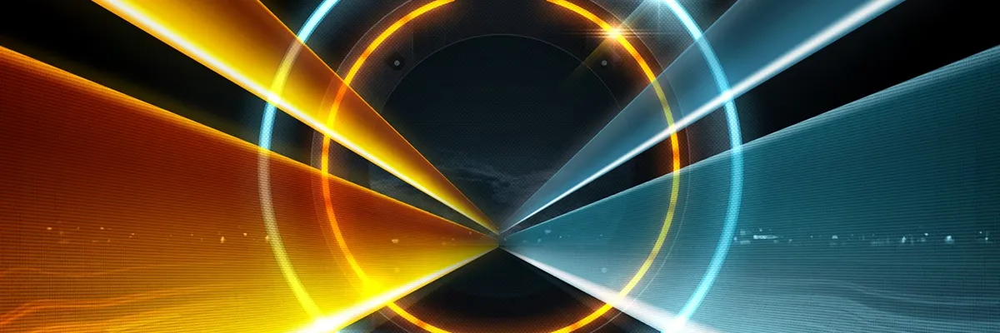
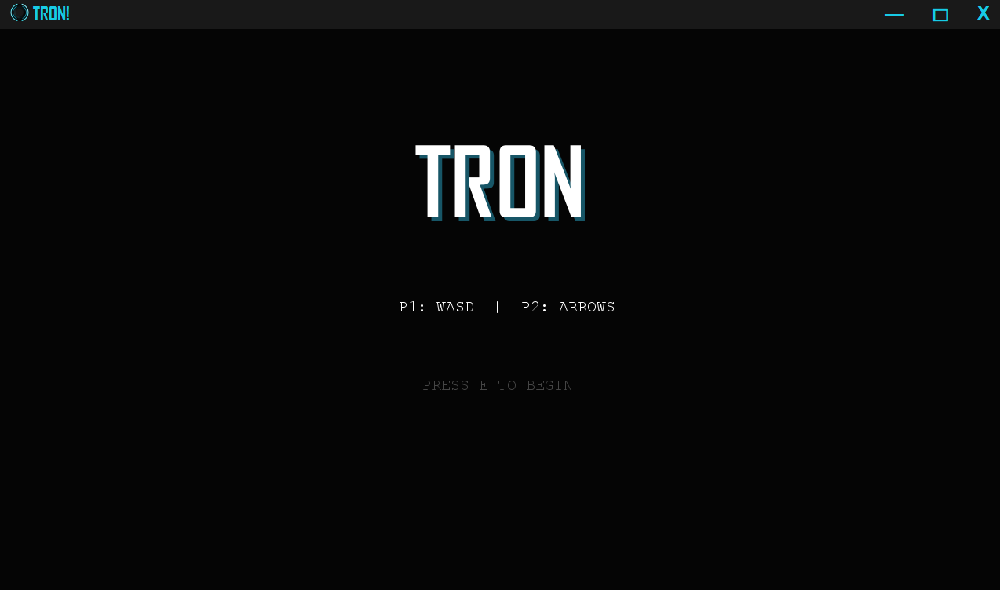
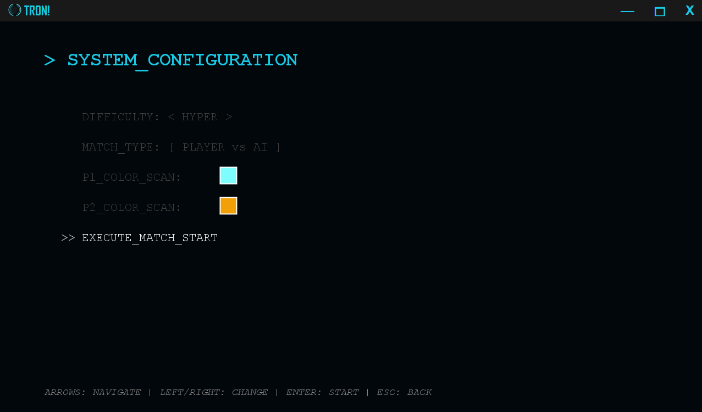
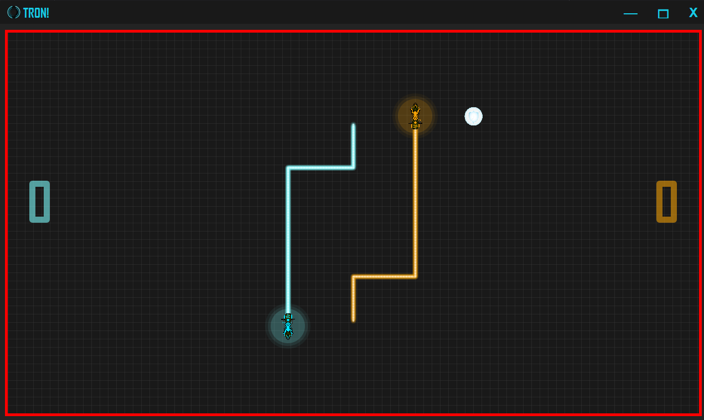
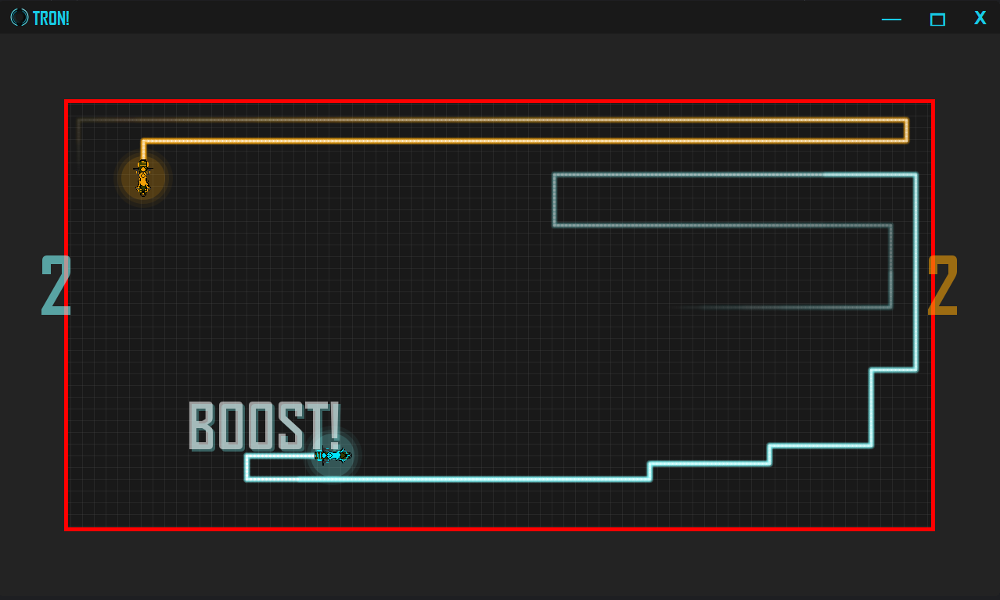
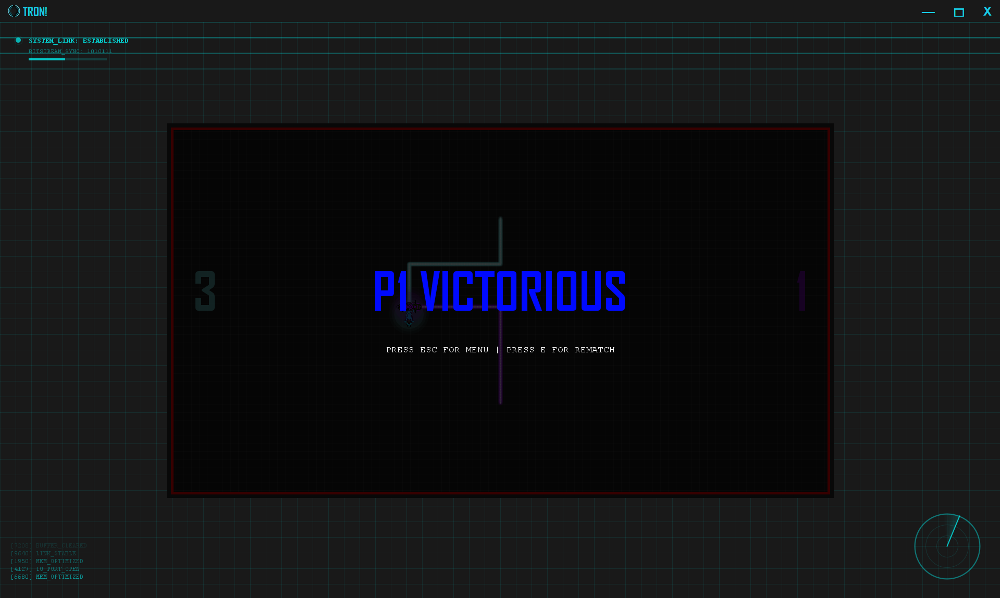
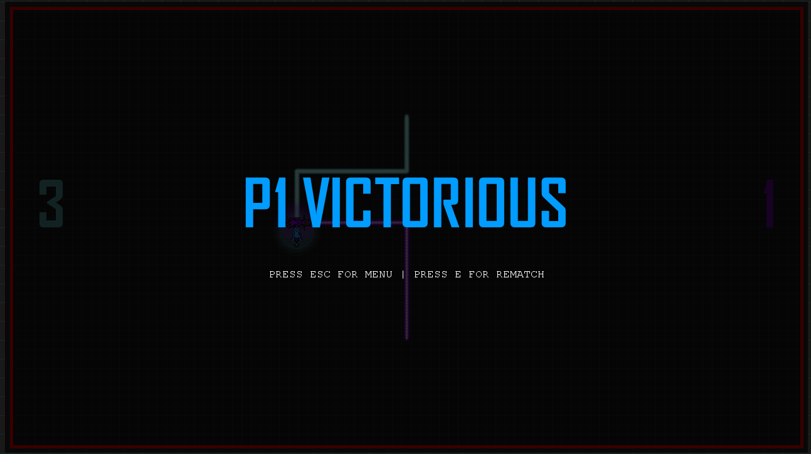

<space><space>
<space><space>

# TRON: The Neon Grid

## Hello, World :D

**TRON: The Neon Grid** is a high-octane, arcade-style battle game where you pilot a futuristic Lightcycle. Leave a trail of light to trap your opponent, but don't hit your own wall! 😊

## Game Features
- **Intense 1v1 Combat:** Play against a friend or challenge the AI.
- **Dynamic Arena:** The walls slowly close in, forcing players into a final showdown.
- **Power-Ups:** Collect speed boosts and invincibility to gain the edge.
- **Retro Audio:** Immersive synth-wave music and crisp arcade sound effects.

## How to start?
Simply run the application and you'll arrive at the Main Menu.

From the **System Configuration** screen, you can customize your match:
- **Difficulty:** Choose between RELAXED, STANDARD, or HYPER speeds.
- **Match Type:** Play against another human (PvP) or the built-in Computer (PvAI).
- **Color Scan:** Pick your signature neon glow for Player 1 and Player 2.

### Gameplay Mechanics
Once the countdown hits zero, the battle begins! Use your reflexes to outmaneuver the enemy.

<article>
<strong>The Grid is alive!</strong> Watch out for the shrinking arena. As the game progresses, the outer walls move inward, making every turn more dangerous.
</article>

### Winning the Match
The game tracks your scores across rounds. Reach the score limit to be crowned the Champion of the Grid!

<article>
Press the "P" button at any time to pause the game or "ESC" to the menu to change your settings.
</article>

<strong>Enter the grid, choose your color, outsmart your opponent and most importantly.. Enjoy :)</strong>

---

## Controls

| Action | Player 1    | Player 2 / Menu |
| :--- |:------------|:----------------|
| **Move Up** | `W`         | `Up Arrow`      |
| **Move Down** | `S`         | `Down Arrow`    |
| **Move Left** | `A`         | `Left Arrow`    |
| **Move Right** | `D`         | `Right Arrow`   |
| **Confirm/Start** | `E \ Enter` | `E \ Enter`     |
| **Pause/Back** | `P \ Esc`   | `P \ Esc`       |

---

## Goodbye World :D
The game is split into specialized "Managers" that handle different parts of the world, one for sounds, one for effects, and one for the game rules. 
This makes the game run smoothly and makes it easy to add new features!

But* not gonna lie, there are a bunch of Bugs, That I wish I could fix, unfortunately I have no time :')
There are a bunch more of cool Features that I wanted to add, for example a Setting screen for button binding a Mute button, Splitting GameLauncher into more Managers like Collision, Paint, State Manager and much more.
But.. it is what it is :D

**Play games, make groups, meet new people, have fun and most importantly.. Enjoy :)**